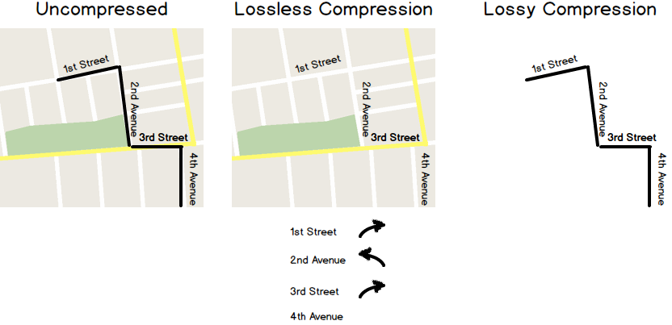

### Compression

#### Example

##### Map

People going to a city they do not know may want to plan which streets to
take to visit different places. There are many ways they can do this.

###### Uncompressed

They can draw on top of the map which streets to take. That way it would be
really easy to know how to continue.

###### Lossless compression

If the map needs to be used to go to many places, all the lines drawn may end
up being too many lines. Instead they can write down what street to take and
where to turn, and along the map they can get the same information they had in
the previous case, although it will be harder to see.

###### Lossy compression

If they cannot take the map with them, for example if they have to return it,
they may also want to write down some other useful information like how far are
the streets from each other, and maybe even draw a small copy of the map.
This time, they do not have all the information, but they have enough.

#### Definition

By compressing we change its representation to be smaller. With
a lossless compression we can get the exact same thing we had in the first
place, but with a lossy compression we will not get as much, but it might be
enough our needs.
