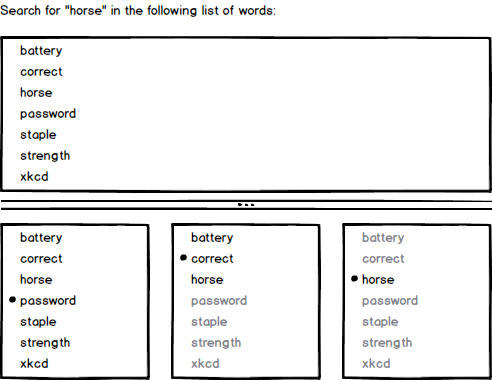

### Binary Search

#### Example

##### Dictionary

I want to look for a word in an English dictionary.
I will open the book in a random page, check out any word in it and compare it
with the word I am looking for. Since I know that the wirds are sorted
alphabetically, I can safely discard all the words between the one I just saw
and the beginning or the end of the dictionary based on this comparison.

I can repeat this process until I find the desired word, noticing that the
range is reduced after every comparison.

Repeating this steps I will reach the desired word, sooner or later. But if
instead of comparing with any random word, I compare with the word that is
exactly in the middle of the not yet discarded list, I am minimizing the
number of required comparisons, since every time I will be discarding half of
the words.

#### Guess Who?

The same algorithm can be applied to the children's game Guess Who?. The
optimal strategy is to ask a question that will discard half of the options.

If you go to the opposite extreme, and ask a very specific question, it is
a high-risk, high-reward scenario. It is very likely you have obtained little
information in most cases, but in a few you have guessed correctly.

#### Properties

Binary Search is a series of steps that we can do to search for a result in a
collection. It is called binary because after each step, we should be able to
remove roughly half of the items in the collection.

In general, it is used on a series of sorted items, like words or numbers.
But the same idea can be used for any search problem that allows to discard
half of the possible results.

Since half of the options are removed after each comparison, it is pretty fast
to find what we are looking for in not so many iterations. For a million
options, we can locate any one in up to twenty comparisons. And for a billion,
up to 30.
