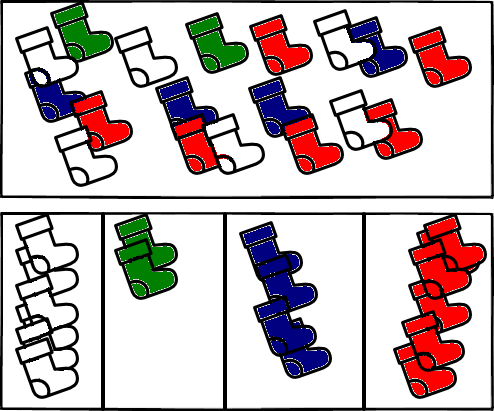

### Hash Map

#### Example

##### Closet

When organizing a closet, people usually group clothing by type. You will see a
pile with t-shirts, a pile with pants, a socks drawer. And now, whenever
you want to pick something, you go to the group that should have it, see
all of the items in there and pick the right one.

Now, if we wanted to, we could add more detail to the arrangement. Instead
of having a socks drawer we can have a green socks drawer, another for red
socks, another for white socks, and so on. As long as we know in which drawer
the sock we are looking for is, we can look it up faster, since we will have
less incorrect items in the drawer.

 Socks made by [Freepik](http://www.freepik.com) from
 [www.flaticon.com](http://www.flaticon.com). Licensed under
 [CC BY 3.0](http://creativecommons.org/licenses/by/3.0/).
 Colored by Sebastian Waisbrot.

#### Properties

If we have enough groups, we can add and look up any item really fast.
